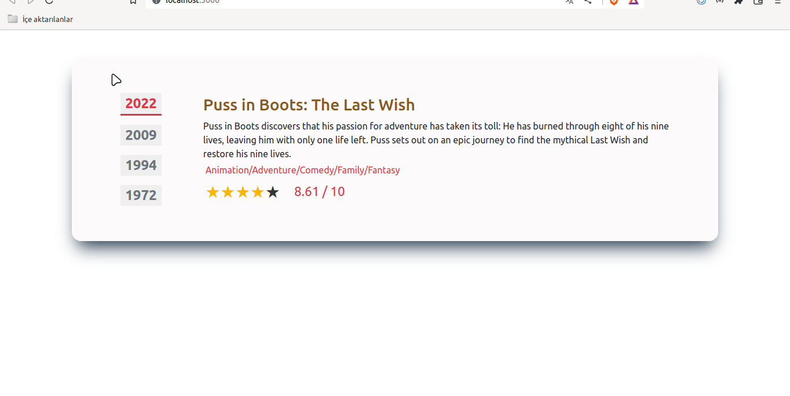

# Film Info

## Description

A Film Info App.

## Skeleton

```
Film Info (folder)

SOLUTION
├── package.json
├── public
│   └── index.html
├── README.md
├── src
│   ├── App.css
│   ├── App.js
│   ├── components
│   │   ├── FilmInfo.jsx
│   │   └── FilmYear.jsx
│   ├── helper
│   │   └── data.js
│   ├── index.js
│   └── pages
│       └── Main.jsx
└── yarn.lock

```

## Expected Outcome



## Objective

The goal is to create a movie Information Application using ReactJS.

### At the end of the project, following topics are to be covered;

- HTML

- CSS

- JS

- ReactJS

**<p align="center">&#9786; Happy Coding &#9997;</p>**
